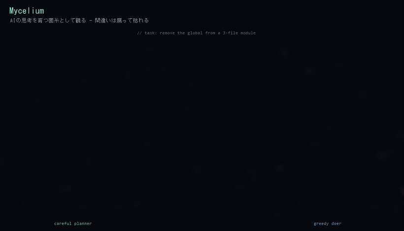

# 🍄 Mycelium

**Watch an AI agent think — as living, glowing fungus.**

### ▶ Live: **[mycelium-dusky.vercel.app](https://mycelium-dusky.vercel.app)**

An AI agent's reasoning and tool-use loop, rendered as a growing organism. Every tool call sprouts a filament, every abandoned plan **rots and withers**, and reaching the answer makes the colony **bloom and release spores**. Two agents race the same task side by side — a careful planner vs. a greedy doer.

Built on the **[Claude Agent SDK](https://code.claude.com/docs/en/agent-sdk/overview)**. The colonies aren't hand-animated — they grow from **real, recorded agent runs**.



> Concept preview render. The live site realizes the same visual from real captured traces.

---

## Why this exists

Most agent visualizers draw a static DAG or a stream of tokens. None show an agent **changing its mind** — the dead-ends, the backtracks, the abandoned approaches. Mycelium shows those as **decay**: when the agent gives up on a plan, that branch browns, curls, and dies, while the productive path keeps growing toward a bloom.

It's the invisible, un-glamorous part of how an agent actually works — made organic, alive, and a little eerie.

## How it works

```
Claude Agent SDK run ──> recorded events ──> colony growth
   tool call            (reason/tool/result/    branch sprouts
   reasoning step        backtrack/done)         filament thickens
   failed / abandoned                            branch ROTS
   done                                          colony BLOOMS
```

- **`scripts/capture-trace.mjs`** runs a real Claude Agent SDK agent (`query()` + `Read/Write/Edit/Glob/Grep`) on a small refactor task and records the event stream to JSON.
- **`lib/trace.ts → specFromTrace()`** turns that event stream into a growth recipe: each tool call → a branch, each failure/backtrack → rot, completion → bloom.
- **`lib/mycelium.ts`** is the procedural renderer: filaments grow with organic jitter and taper, a glow layer is composited for the bioluminescent look, dead branches decay, and finished colonies bloom with drifting spores. Deterministic (seeded PRNG) so every replay is identical.
- The traces are recorded and **bundled as static JSON**, so the deployed site costs **$0 in LLM calls** to view.

## What you're watching

Two real runs of the same task — *remove a module-level global from a 3-file TypeScript module*:

| colony | strategy | what actually happened |
|---|---|---|
| **careful planner** | explore → read → plan → minimal edits | more steps, and it stumbled once (that's the rot) |
| **greedy doer** | start editing immediately | fewer steps, no stumble |

Honest detail: in the real runs, the *careful* agent is the one that hit a snag. No staging — that's what the data showed.

## Run it locally

```bash
npm install
npm run dev        # http://localhost:3000
```

Capture your own traces (needs an `ANTHROPIC_API_KEY`, or an authenticated Claude Code login):

```bash
node scripts/capture-trace.mjs left  "careful planner" "Carefully refactor away the global..."
node scripts/capture-trace.mjs right "greedy doer"     "Remove the global as fast as possible..."
```

## Tech

Next.js (App Router) · TypeScript · 2D Canvas · `@anthropic-ai/claude-agent-sdk` · deployed on Vercel (static).

## Roadmap

- [ ] **BYOK live mode** — paste your own API key, run a real agent, and watch *your* colony grow (rate-limited, with a global kill-switch that falls back to recorded replay).
- [ ] More tasks & a task picker.
- [ ] Attach an external MCP server (e.g. the author's key-free [`hl-read`](https://github.com/akagifreeez/hl-read)) as a third colony.

## Honesty notes (盛らない)

This is a focused, deliberately small visualization — not a full agent platform. The colonies render **real** captured Agent SDK runs, but the demo replays recorded traces rather than running a live agent in the browser (see roadmap). The glow compositing uses `ctx.filter`, which is best in Chromium/Firefox.

---

Built by [@akagifreeez](https://github.com/akagifreeez).
